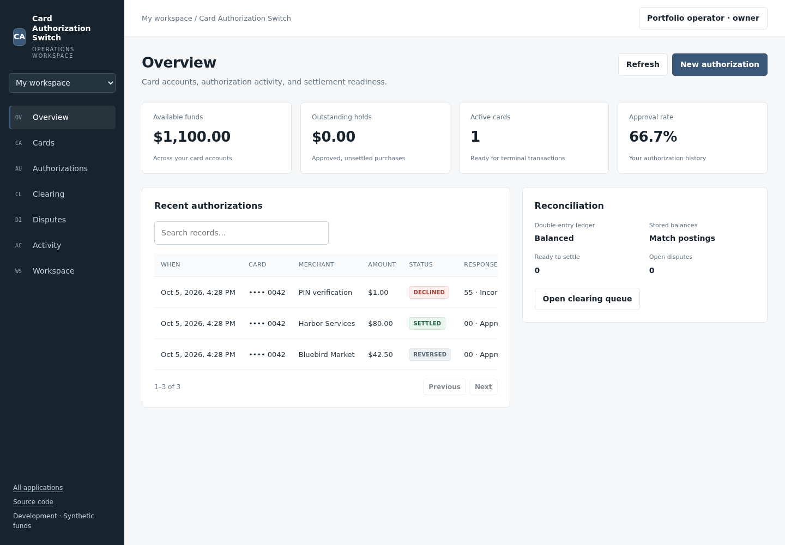
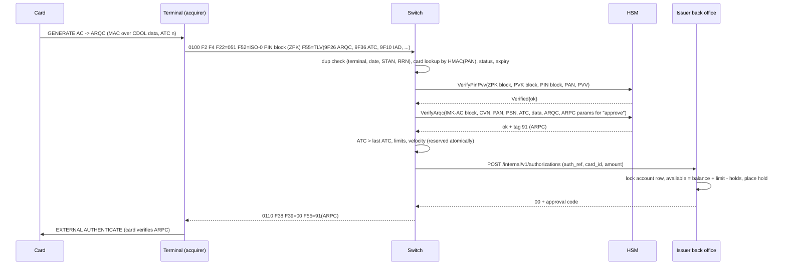
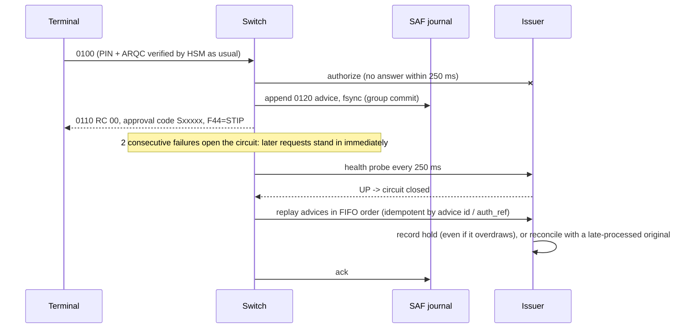
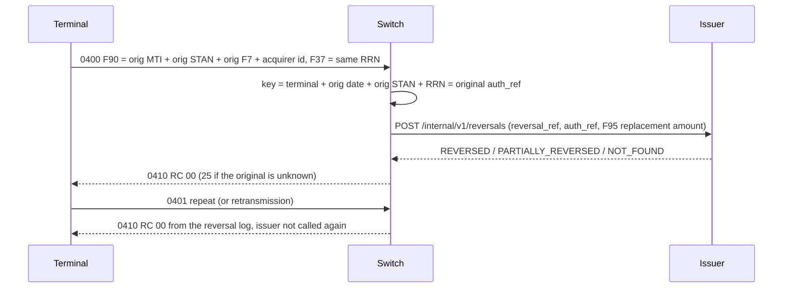

# card-auth-switch

**[Open the application](https://leads.realalma.com/fintech/card-auth-switch/)** · Issue and fund cards; manage card status; authorize purchases; inspect persistent holds; reverse or settle authorizations; attach dispute evidence; process chargeback clearing and representment; and record resolutions.

An ISO 8583 card authorization switch in Rust, with EMV cryptogram verification through a
simulated HSM, and a Java issuer back office (double-entry ledger, holds, clearing, disputes).

> **Portfolio project.** It is not connected to any card network. It has not been certified
> by any scheme. It is **not PCI DSS compliant**. The "HSM" is a normal process that holds its
> master key in memory, so it is **not a real HSM**. Every card, key and amount in this
> repository is test data. The keys in `config/` are published here on purpose and are public.

## Use the application

Create an account, sign in, or open a private workspace and save your account later. One account works across all four applications. Workspaces have persistent records, searchable tables, activity logs, and team invitations. Your saved data is retained when you reload or sign in from another device.

Terminal requests use the Rust switch, EMV verification, simulated HSM, and Java issuer. A purchase remains held until reversed or settled. Settlement and dispute transitions produce actual double-entry postings.

All funds, cards, institutions, and sample transactions are synthetic. The applications do not connect to real banking or card networks.

[Application workflows and hosting details](docs/application.md)



## What a card switch does

When a cardholder taps or inserts a card, the acquirer (the merchant's bank or processor) sends
an **ISO 8583** authorization request through the card network to the issuer's processing host.
That host is the switch built here. For each request it:

1. **Parses the message.** ISO 8583 has an MTI, a bitmap, and about 128 positional data
   elements, encoded in ASCII, BCD or binary.
2. **Authenticates the card and the cardholder** without ever seeing a clear PIN or key. It
   asks an HSM to verify the encrypted PIN block, the chip's **ARQC** cryptogram, or the
   magstripe CVV.
3. **Applies card rules.** These cover status, expiry, PIN-try counter, ATC replay, per-transaction
   limits and velocity limits.
4. **Gets an open-to-buy decision from the issuer's ledger** and places a hold.
5. **Answers within a deadline.** If the issuer cannot answer in time, the switch **stands in**
   (STIP) using stand-in limits, and stores advices that it forwards later.
6. **Handles reversals and repeats idempotently**, so that a timed-out terminal never charges
   the cardholder twice.

A few days later the acquirer sends **clearing** records (presentments) for the money that
actually moves. The issuer matches them to holds, posts them to the ledger, and handles
**chargebacks** when cardholders dispute transactions.

## Architecture

```mermaid
flowchart LR
  subgraph Acquirer side (simulated)
    T[termsim<br/>EMV card emulator + terminal<br/>ISO 8583 client, load generator]
  end
  subgraph Issuer processing
    S[card-switch (Rust, tokio)<br/>ISO 8583 TCP server<br/>auth rules, reversals, dup detection<br/>circuit breaker, STIP, SAF journal]
    H[hsm (Rust, separate process)<br/>LMK-wrapped keys<br/>PIN / CVV / ARQC / ARPC]
    I[issuer back office (Java 21, Spring Boot)<br/>cards, double-entry ledger, holds<br/>clearing, disputes]
    DB[(PostgreSQL)]
    J[(SAF journal<br/>append-only, fsync)]
  end
  T -- "2-byte length-prefixed ISO 8583:1987" --> S
  S -- "JSON commands, multiplexed TCP" --> H
  S -- "HTTP/JSON internal API, 250 ms deadline" --> I
  S --- J
  I --- DB
  C[clearing files<br/>PRES / CHBK / REPR] --> I
```

| Component | Path | Language |
|---|---|---|
| ISO 8583 codec, spec-driven field table, BER-TLV | `crates/iso8583` | Rust |
| Payment crypto (PIN blocks, PVV, IBM 3624, CVV, EMV) on RustCrypto `des` | `crates/cardcrypto` | Rust |
| Simulated HSM: server, protocol and client | `crates/hsm` | Rust |
| Switch | `crates/switch` | Rust |
| Card generator, EMV card emulator, terminal, demo, benchmarks | `crates/termsim` | Rust |
| Issuer back office | `issuer/` | Java 21, Spring Boot 3.5, Flyway, PostgreSQL |

### Chip + PIN authorization



### Issuer outage, stand-in, recovery



### Reversal



## Supported messages

| MTI | Meaning | Handling |
|---|---|---|
| 0800 / 0810 | Network management | F70 `001` sign-on, `002` sign-off, `301` echo. Financial messages before sign-on get RC 58. |
| 0100 / 0110 | Authorization (dual message) | Full flow above. |
| 0200 / 0210 | Financial request (single message, e.g. ATM cash, F3 = `01`) | Same flow. Cash requires PIN and has a daily cash limit. |
| 0120 / 0130, 0220 / 0230 | Advice from the acquirer | Card resolved, then forwarded to the issuer as an advice (or stored and forwarded later). |
| 0400 / 0410, 0401 | Reversal request, repeat | Matched to the original. Idempotent. Full or partial (F95). |
| 0420 / 0430, 0421 | Reversal advice, repeat | Always acknowledged. Queued if the issuer is down. |

**Response codes used:** 00, 05, 12, 13, 14, 25, 30, 41, 43, 51, 54, 55, 58, 61, 62, 65, 75,
82 (bad ARQC/CVV), 91, 94, 96.

**Data elements used by the switch:** 2, 3, 4, 7, 11, 12, 13, 14, 18, 22, 23, 25, 32, 35, 37,
38, 39, 41, 42, 43, 44, 49, 52, 55, 70, 90, 95. The codec itself defines all 128 elements of
ISO 8583:1987. It ships four profiles:

* 1987 ASCII (used on the wire here)
* 1987 BCD (packed numerics, BCD length prefixes)
* 1987 text (hex bitmaps)
* partial 1993

The 1993 differences are covered in [docs/design.md](docs/design.md).

**EMV tags read from field 55:** 9F26, 9F27, 9F10, 9F36, 9F37, 9F02, 9F03, 9F1A, 95, 5F2A, 9A,
9C, 82, 5F34. The response returns tag **91**.

**Cryptogram versions:** Visa **CVN 10** (MK-AC used directly, padding method 1, CVR, ARPC
method 1) and **CVN 18** (EMV common session key, padding method 2, full IAD, ARPC method 2).

## Correctness evidence

* **Published test vectors** (`crates/cardcrypto/tests/vectors.rs`, 14 tests). They come from the
  open-source payment crypto libraries [pyemv](https://github.com/knovichikhin/pyemv) and
  [psec](https://github.com/knovichikhin/psec). The EMV vectors are from pyemv's `*_hsm.py` test
  suites, whose values that project describes as cross-checked on a hardware HSM. Covered:
  * EMV option A and option B ICC master key derivation
  * common session key derivation
  * ISO 9797-1 MAC alg. 3 ARQC
  * ARPC method 1 and method 2
  * Visa CVN 10 and CVN 18 end to end
  * ISO 9564 format 0 PIN blocks, including the malformed-block rejections
  * Visa PVV
  * IBM 3624 natural PIN and offset
  * CVV, including the classic `4123456789012345 / 8701 / 101 -> 561` example
  * KCV `08D7B4`

  All pass.
* **Differential test** (`tests/differential.rs`). 60 seeded random cases were generated by
  `scripts/gen-differential-vectors.py` with pyemv and psec, and include 19-digit PANs for
  option B. Every derived key, ARQC, ARPC, PVV, PIN block and CVV matches.
* **Property tests** (proptest). They check encode/decode round trips for all four codec
  profiles. They also check that arbitrary bytes, plausible headers and single-byte corruptions
  of valid messages never panic, plus a TLV round trip and PIN block round trips.
* **End-to-end tests over TCP** (`crates/switch/tests/flow.rs`). They run the real HSM server
  and a mock issuer, and cover:
  * sign-on enforcement
  * approve and duplicate replay
  * ATC replay, wrong PIN, PIN-tries-exceeded
  * forged ARQC
  * insufficient funds with a decline ARPC that the card accepts
  * lost, expired and unknown cards
  * magstripe CVV
  * the cash PIN rule
  * reversal idempotency and late original after a reversal
  * stand-in limits, then SAF replay in order
  * malformed frames
  * concurrency
* **Issuer tests** (JUnit 5, 27 tests). They run on H2 in PostgreSQL mode by default, and the same
  suite passes on PostgreSQL 14 (`ISSUER_TEST_PROFILE=pg`). They cover:
  * ledger balance and idempotency invariants
  * open-to-buy with 16 concurrent threads (no overselling)
  * incremental authorizations, partial reversals and hold expiry
  * stand-in overdraft and the timeout race
  * clearing matching (tolerance, split shipments, force post, unknown card, duplicates)
  * the full dispute lifecycle with deadlines and evidence rules
  * the JSON contract the switch relies on

Totals: **63 Rust tests** (`cargo test --workspace`) and **27 Java tests** (`mvn verify`), all
passing.

## Security model of the simulated HSM

* **Key hierarchy.** A local master key (LMK, AES-256) exists only inside the HSM process.
  Every working key exists outside the HSM only as a **key block**: `K1` + TR-31 usage code +
  AES-256-GCM(LMK, key), with the header authenticated as associated data. The usage codes are:

  | Code | Key |
  |---|---|
  | `K0` | ZMK |
  | `P0` | ZPK |
  | `V2` | PVK |
  | `C0` | CVK |
  | `E0` | IMK-AC |

  A ZPK block passed where a PVK is expected is refused. Relabelling the header breaks the tag.
  This mirrors the intent of TR-31 / X9.143 key blocks, but the format is simplified and
  non-standard.
* **Card keys.** These are never stored. MK-AC is derived per transaction from the IMK (EMV
  option A or B), and the session key from the ATC.
* **Narrow API.** No command returns a clear key or a clear PIN. The switch can only ask
  questions:
  * `VerifyPinPvv`, `VerifyPinIbm3624`
  * `VerifyCvv`
  * `VerifyArqc` (+ ARPC)
  * `TranslatePin` (ZPK to ZPK)
  * `GeneratePvv`, `GenerateCvv`
  * `GenerateKey`, `ImportKey` (under ZMK)
  * `KeyCheckValue`

  `FormKeyFromComponents` is refused unless the HSM is started in `--authorized` state, which
  models the officer cards needed for a key ceremony. Comparisons are constant time, and clear
  material in the HSM is zeroized on drop.
* **What it is not.** There is no tamper resistance and no secure memory. The LMK comes from a
  file. There is no dual control, no audit log and no FIPS 140 / PCI PTS HSM certification. The
  switch also holds PANs in memory and logs masked PANs only. The issuer stores only
  HMAC-SHA256(PAN) references. A real deployment would still need tokenization, encryption at
  rest and network segmentation, which are out of scope here.

## Measured benchmarks

Run with `scripts/bench.sh`. Raw JSON is in [`bench-results/`](bench-results/).

**Machine.** Contabo VPS, 8 vCPU (Intel Broadwell, virtualized), 23 GB RAM, Ubuntu 22.04,
PostgreSQL 14 (`fsync` and `synchronous_commit` on), OpenJDK 21, Rust 1.99.

**Load caveat.** The VPS was **shared with other CPU-intensive workloads during the runs**. Load
average was 15.7 at the start of the main run and 23.3 at the start of the low-concurrency run,
on 8 vCPUs. The numbers below are therefore pessimistic, and also noisy. Everything runs on the
same box: load generator, switch, HSM, issuer JVM and PostgreSQL.

**Workload.** Every end-to-end transaction is a chip + PIN purchase. That means one PIN
verification and one ARQC verification with ARPC in the HSM, plus one issuer authorization
(a PostgreSQL transaction with a row lock, a hold insert and a commit). There were 2,000 cards,
half CVN 10 and half CVN 18, and every response was checked.

Main run (64 closed-loop workers, 4 TCP connections, 30 s, after 5 s warm-up):

| Scenario | ops/s | p50 ms | p99 ms | max ms |
|---|---:|---:|---:|---:|
| HSM alone (PIN verify + ARQC verify/ARPC per op) | 12,901 | 3.79 | 23.55 | 66.3 |
| Issuer internal API alone (HTTP/JSON + PostgreSQL) | 1,529 | 38.91 | 108.80 | 249.1 |
| **End to end over TCP, issuer up** | **1,405** | **38.56** | **157.95** | 288.0 |
| **End to end over TCP, issuer down (all stand-in)** | **2,615** | **19.18** | **91.33** | 219.5 |

Low concurrency (8 workers, 2 connections, 20 s):

| Scenario | ops/s | p50 ms | p99 ms | max ms |
|---|---:|---:|---:|---:|
| HSM alone | 4,545 | 1.01 | 12.86 | 149.6 |
| Issuer internal API alone | 533 | 11.10 | 71.23 | 187.9 |
| **End to end, issuer up** | **419** | **14.28** | **77.44** | 223.5 |
| **End to end, stand-in** | **1,432** | **3.77** | **29.73** | 120.0 |

Where the time goes, from the switch's own per-stage histograms in the low-concurrency run
(`switch-stages-*.json`):

| Stage | Issuer up, p50 / p99 | Stand-in, p50 / p99 |
|---|---|---|
| HSM PIN verify | 0.31 / 8.7 ms | 0.31 / 7.2 ms |
| HSM ARQC verify | 0.27 / 8.0 ms | 0.28 / 7.2 ms |
| Issuer authorize call | 11.9 / 75.3 ms | n/a |
| SAF journal append + fsync | n/a | 1.7 / 16.1 ms |
| Total in switch | 13.5 / 78.1 ms | 2.6 / 22.2 ms |

**Reading the numbers.**

* The issuer call is about 88% of the switch's time when the issuer is up, and the issuer's
  throughput caps end-to-end throughput.
* In stand-in, the per-transaction fsync dominates. Group commit amortizes it across concurrent
  requests, which is why stand-in throughput is higher than issuer-up throughput.
* In the 64-worker run, 77 transactions (0.17%) missed the 250 ms issuer deadline and were
  approved in stand-in. That is the designed behavior under overload.

These are single-box development numbers, not a capacity claim.

## How to run

You need Rust ≥ 1.80, JDK 21, and either Docker or local PostgreSQL binaries. The issuer uses the
Maven wrapper (Maven 3.9.16).

```bash
cargo test --workspace                     # Rust tests
(cd issuer && ./mvnw verify)               # Java tests on H2 (PostgreSQL mode)
ISSUER_TEST_PROFILE=pg ISSUER_DB_URL=jdbc:postgresql://127.0.0.1:56543/issuer \
  ./issuer/mvnw -f issuer/pom.xml verify   # same suite on PostgreSQL

scripts/demo.sh        # fresh DB, full scenario, writes docs/demo-transcript.txt
scripts/bench.sh       # benchmarks into bench-results/
scripts/stack.sh up    # run everything; switch on 127.0.0.1:27583 (stop: scripts/stack.sh down)
```

`scripts/pg-local.sh` starts a throwaway PostgreSQL. It uses Docker when available, otherwise
`initdb` into `.run/pg`.

Ports:

| Service | Port |
|---|---|
| Switch | 27583 |
| HSM | 27910 |
| Issuer | 27180 |
| PostgreSQL | 56543 |

### The demo

`scripts/demo.sh` runs the scenario below. The output is saved in
[docs/demo-transcript.txt](docs/demo-transcript.txt).

1. Sign-on and echo.
2. A chip + PIN purchase, showing the full masked message dump and the card verifying the ARPC.
3. A retransmitted request, answered from the duplicate cache.
4. A wrong PIN.
5. A purchase reversed with 0400, then repeated with 0401.
6. A forged ARQC.
7. Insufficient funds, with a decline ARPC.
8. A lost card.
9. A magstripe purchase with CVV.
10. A partial reversal of a fuel pre-auth.
11. The issuer is frozen with `SIGSTOP`. Two transactions wait for the 250 ms deadline and are
    stood in, the circuit opens, and an over-limit transaction is declined with RC 91.
12. The issuer is resumed. The issuer processes the late originals *and* receives the replayed
    advices for the same transactions, and reconciles them to one hold each that carries the
    stand-in approval code.
13. The issuer crashes (`kill -9`), the switch stands in immediately, and after the restart the
    stored advice is forwarded.
14. A clearing file arrives: exact matches, a stand-in match, a partial-reversal match and a
    force post.
15. A chargeback: refused without evidence, then raised, confirmed by the network, with the
    audit trail shown.
16. A trial balance check.

## Limitations (honest list)

* No real network connectivity or certification. The field usage follows ISO 8583:1987
  conventions but is not any specific network's specification.
* CVN 10 and 18 only (Visa-style). No Mastercard M/Chip session keys and no AES/CVN 22, though
  the primitives are in place.
* PIN verification uses Visa PVV in the flow. IBM 3624 is implemented and exposed by the HSM but
  not wired into card profiles. The terminal PIN pad encrypts directly under the zone PIN key,
  with no DUKPT or TPK→ZPK translation hop in the flow (`TranslatePin` exists and is tested).
* The switch's duplicate cache, authorization log, PIN-try counters and ATC high-water marks are
  in memory. The issuer's idempotency by `auth_ref` and `reversal_ref` protects money movement
  across a switch restart, but the PIN-try and ATC state would be lost. A production switch would
  persist them.
* Only one switch instance. There is no active/active pairing and the SAF journal is local.
* There is no MAC on ISO messages (F64/F128), no TLS on internal links, and no key exchange
  (0800 F70=101/161).
* The clearing file is a documented home-grown format ([docs/clearing-format.md](docs/clearing-format.md)),
  modelled on presentment, chargeback and representment records. It is not a Visa BASE II or
  Mastercard IPM file. The dispute time limits are illustrative.
* Single currency (840). There is no FX and no fee or interchange calculation.

## License

MIT, see [LICENSE](LICENSE).
